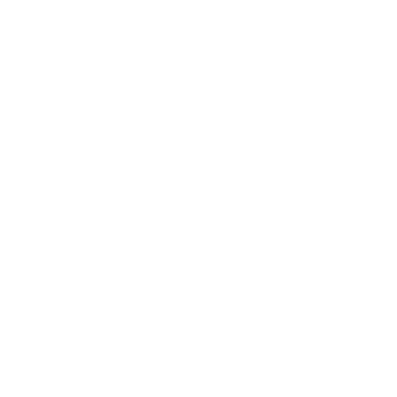
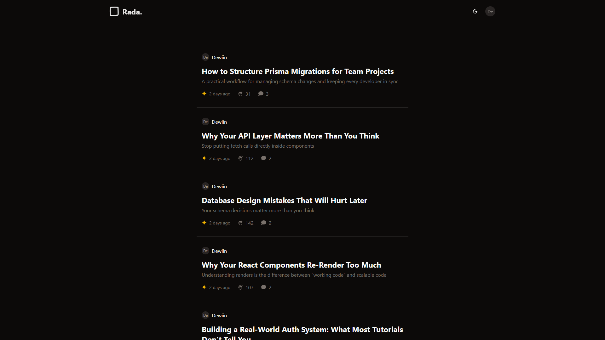
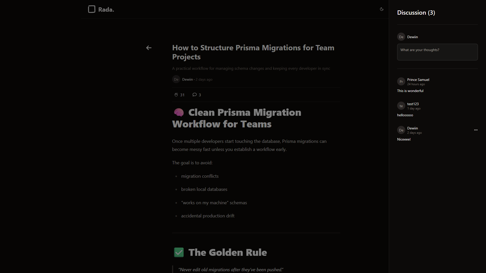
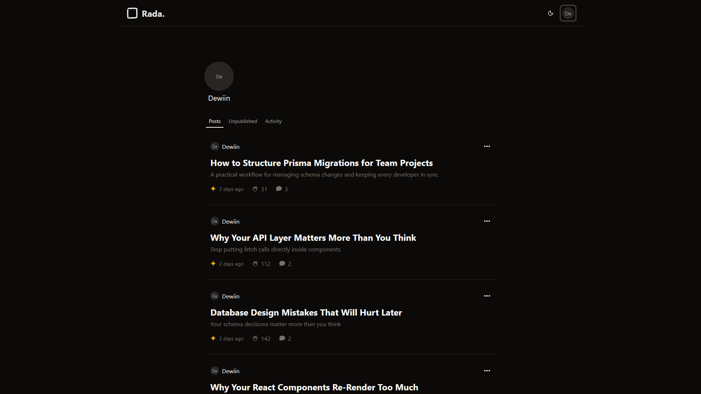
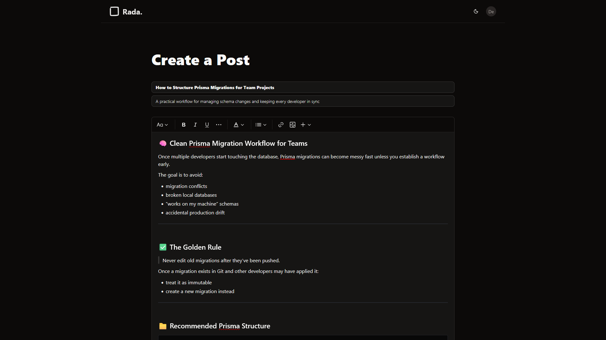

# Rada

  
  <h1>Rada</h1>

  

Table of Contents

<ol>
  <li>
    <a href="#introduction">Introduction</a>
    <ul>
      <li>
        <a href="#server">Server</a>
      </li>
    </ul>
  </li>
  <li>
    <a href="#features">Features</a>
    <ul>
      <li>
        <a href="#built-with">Built With</a>
      </li>
    </ul>
  </li>
  <li><a href="#preview">Preview</a></li>
  <li><a href="#contributing">Contributing</a></li>
  <li><a href="#license">License</a></li>
</ol>

## Introduction
Rada Blog is a full-stack blogging platform built with React, TypeScript, Express, Prisma, and PostgreSQL. The frontend provides a modern writing and reading experience with authentication, rich text editing, comments, and responsive UI components.

This repository contains the client-side application.

## Server
Rada's frontend communicates with a separate RESTful API built with Express, Prisma, and PostgreSQL.
- Backend Repository: https://github.com/Dewiin/rada-blog-api
- Backend Deployment: https://rada-blog-api.onrender.com

## Features
- ✍️ Rich Text Blog Editor
    - Create and publish posts using a modern Tiptap editor.
    - Supports headings, quotes, bullet lists, code blocks, and formatted text.
    - Save drafts before publishing posts publicly.
- 💬 Discussion System
    - Users can comment on blog posts.
    - Expandable comment input with validation feedback.
    - Real-time discussion updates after posting comments.
- 👏 Engagement Features
    - Clap/react system for blog posts.
    - Track user engagement and post popularity.

### Built With

[![React][React]][React-url]
[![React-router][React-router]][React-router-url]
[![React-hook-form][React-hook-form]][React-hook-form-url]
[![Vite][Vite]][Vite-url]
[![Shadcn][Shadcn]][Shadcn-url]
[![Tailwind][Tailwind]][Tailwind-url]

<a href="#readme-top">Back to top</a>

## Preview

### Home Screen

### Post and Comments

### Profile Page

### Create a Post

<a href="#readme-top">Back to top</a>

## Contributing

I like open-source and want to develop practical applications for real-world problems. However, individual strength is limited. So, any kinds of contribution is welcome, such as:

- New features
- Bug fixes
- Typo fixes
- Suggestions
- Maintenance
- Documents
- etc.

#### Heres how you can contribute:

1. Fork the repository
2. Create a new feature branch
3. Commit your changes
4. Push to the branch
5. Submit a pull request

<a href="#readme-top">Back to top</a>

## License

MIT License

Copyright (c) 2026 Devin

Permission is hereby granted, free of charge, to any person obtaining a copy
of this software and associated documentation files (the "Software"), to deal
in the Software without restriction, including without limitation the rights
to use, copy, modify, merge, publish, distribute, sublicense, and/or sell
copies of the Software, and to permit persons to whom the Software is
furnished to do so, subject to the following conditions:

The above copyright notice and this permission notice shall be included in all
copies or substantial portions of the Software.

THE SOFTWARE IS PROVIDED "AS IS", WITHOUT WARRANTY OF ANY KIND, EXPRESS OR
IMPLIED, INCLUDING BUT NOT LIMITED TO THE WARRANTIES OF MERCHANTABILITY,
FITNESS FOR A PARTICULAR PURPOSE AND NONINFRINGEMENT. IN NO EVENT SHALL THE
AUTHORS OR COPYRIGHT HOLDERS BE LIABLE FOR ANY CLAIM, DAMAGES OR OTHER
LIABILITY, WHETHER IN AN ACTION OF CONTRACT, TORT OR OTHERWISE, ARISING FROM,
OUT OF OR IN CONNECTION WITH THE SOFTWARE OR THE USE OR OTHER DEALINGS IN THE
SOFTWARE.

[React]: https://img.shields.io/badge/React-%2320232a.svg?style=for-the-badge&logo=react&logoColor=%2361DAFB
[React-url]: https://react.dev/

[React-router]: https://img.shields.io/badge/React_Router-CA4245?style=for-the-badge&logo=react-router&logoColor=white
[React-router-url]: https://reactrouter.com/

[React-hook-form]: https://img.shields.io/badge/React%20Hook%20Form-EC5990?style=for-the-badge&logo=reacthookform&logoColor=fff
[React-hook-form-url]: https://react-hook-form.com/

[Vite]: https://img.shields.io/badge/Vite-646CFF?style=for-the-badge&logo=vite&logoColor=fff
[Vite-url]: https://vite.dev/

[Shadcn]: https://img.shields.io/badge/shadcn%2Fui-000?style=for-the-badge&logo=shadcnui&logoColor=fff
[Shadcn-url]: https://ui.shadcn.com/

[Tailwind]: https://img.shields.io/badge/tailwindcss-%2323B2AC?style=for-the-badge&logo=tailwind-css&logoColor=white
[Tailwind-url]: https://tailwindcss.com/
